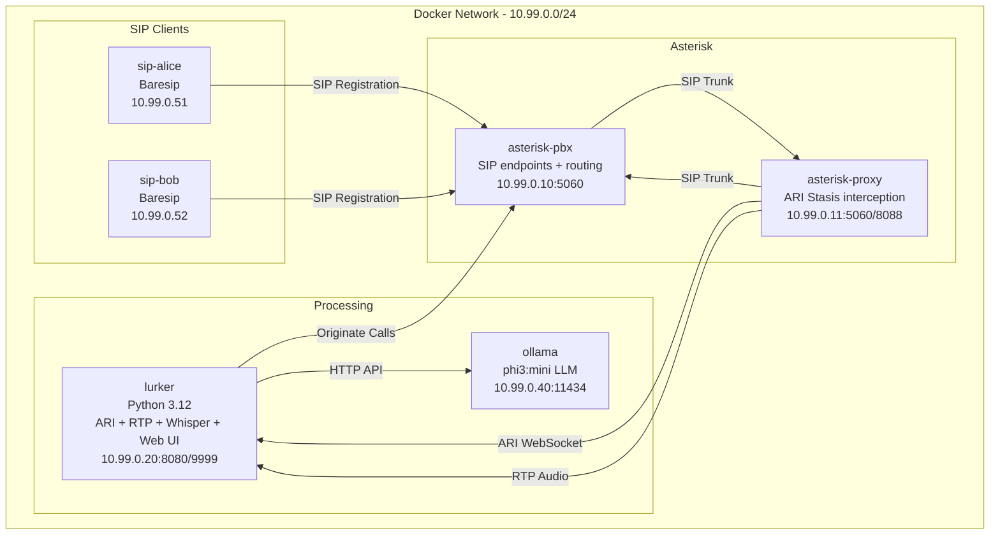
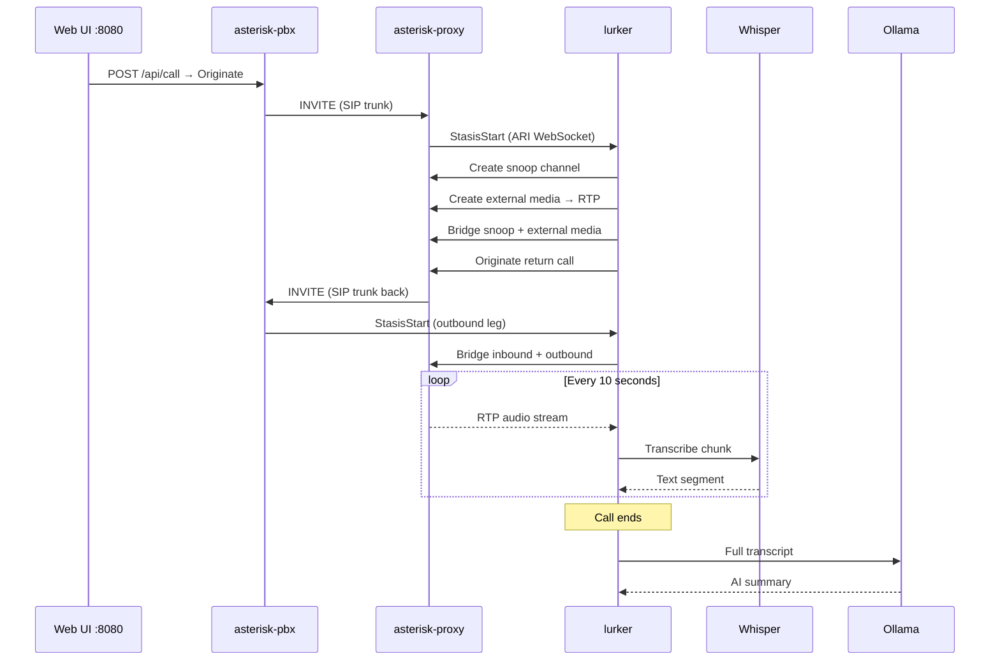

<p align="center">
  
</p>

# Lurker

Real-time VoIP call interception, transcription, and AI summarization. Lurker sits transparently between SIP endpoints, captures call audio via Asterisk ARI, transcribes speech with Whisper, and generates call summaries using a local LLM.

No cloud services. Everything runs locally in Docker.

## How It Works

A call between two SIP clients is routed through an Asterisk proxy. Lurker connects to the proxy via ARI WebSocket, creates a snoop channel to tap the audio without disturbing the call, receives the RTP stream, transcribes it in 10-second chunks with Whisper, and when the call ends, feeds the full transcript to an LLM for summarization.

```
Alice calls Bob → PBX routes through Proxy → Lurker snoops audio via ARI
→ RTP stream → Whisper transcription → Ollama summarization → Done
```

## Architecture



## Call Flow



## Containers

| Container | Image | Role |
|---|---|---|
| `asterisk-pbx` | `andrius/asterisk:22` | Primary PBX. Hosts SIP endpoints (alice, bob), routes calls to proxy. |
| `asterisk-proxy` | `andrius/asterisk:22` | Interception proxy. Receives calls, enters them into ARI Stasis for Lurker to control. |
| `lurker` | Python 3.12-slim | Core application. ARI client, RTP receiver, Whisper transcriber, web UI, Ollama client. |
| `ollama` | `ollama/ollama` | Local LLM. Runs phi3:mini for call summarization. |
| `sip-alice` | Debian + Baresip | Simulated SIP client. Auto-answers, plays a pre-generated speech WAV via espeak-ng. |
| `sip-bob` | Debian + Baresip | Simulated SIP client. Auto-answers, plays a pre-generated speech WAV via espeak-ng. |

## Audio Pipeline

```
RTP (ulaw, 8kHz) → Strip 12-byte header → Decode μ-law to 16-bit PCM
→ Buffer 10s chunks (160KB) → Resample to 16kHz → faster-whisper (base.en, int8)
→ Accumulate transcript → On hangup: summarize via Ollama
```

## Quick Start

```bash
git clone <repo> && cd lurker
docker compose up -d
```

Wait for Ollama to pull phi3:mini (~2.6GB on first run), then open [http://localhost:8080](http://localhost:8080) and click **Start Call**.

Watch the logs:

```bash
docker logs -f lurker
```

## Configuration

All configuration is via environment variables in `docker-compose.yml`:

| Variable | Default | Description |
|---|---|---|
| `ARI_URL` | `http://asterisk-proxy:8088` | Asterisk ARI endpoint |
| `ARI_APP` | `lurker` | Stasis application name |
| `ARI_USER` / `ARI_PASS` | `lurker` / `lurkerpass` | ARI credentials |
| `RTP_LISTEN_HOST` | `10.99.0.20` | Lurker's IP for RTP reception |
| `RTP_LISTEN_PORT` | `9999` | UDP port for incoming RTP |
| `WHISPER_MODEL` | `base.en` | Whisper model size (`tiny.en`, `base.en`, `small.en`, `medium.en`, `large`) |
| `OLLAMA_URL` | `http://ollama:11434` | Ollama API endpoint |
| `OLLAMA_MODEL` | `phi3:mini` | LLM model for summarization |

## Project Structure

```
lurker/
├── docker-compose.yml
├── asterisk-pbx/conf/          # PBX Asterisk configs (pjsip, extensions, ari)
├── asterisk-proxy/conf/        # Proxy Asterisk configs
├── sip-clients/
│   ├── Dockerfile
│   └── entrypoint.sh           # Baresip dynamic config generator
├── lurker/
│   ├── Dockerfile
│   ├── requirements.txt
│   └── src/
│       ├── main.py             # Entry point, orchestration
│       ├── ari_controller.py   # ARI WebSocket client, call/snoop/bridge management
│       ├── rtp_receiver.py     # UDP RTP receiver, μ-law decode
│       ├── audio_buffer.py     # PCM chunking (10s segments)
│       ├── transcriber.py      # faster-whisper speech-to-text
│       ├── summarizer.py       # Ollama LLM client
│       ├── web.py              # FastAPI UI + call trigger API
│       └── models.py           # CallSession, TranscriptChunk
└── media/
    └── lurker.png
```

## Tech Stack

- **SIP/PBX**: Asterisk 22, PJSIP
- **SIP Clients**: Baresip (auto-answer, sine tone source)
- **Call Interception**: Asterisk ARI (WebSocket + REST)
- **Audio**: μ-law codec, 8kHz, RTP
- **Transcription**: faster-whisper (CPU, int8 quantization)
- **Summarization**: Ollama + phi3:mini (3.8B params)
- **Web**: FastAPI + Uvicorn
- **Runtime**: Python 3.12, Docker Compose

## License

MIT
